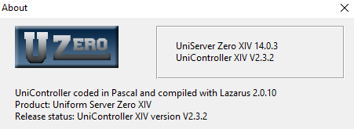

# IT7537 Ongaonga Bed & Breakfast assignment
Our task was to create the login/session checking and booking page with PHP. Customers and Rooms were given to us.

## Tools
- This project uses `PHP` and a program called `UniserverZ` which hosts a local Apache server and MySQL database so we do not have to.
- Uniserverz version: 14.0.3. Website: https://www.uniformserver.com/

